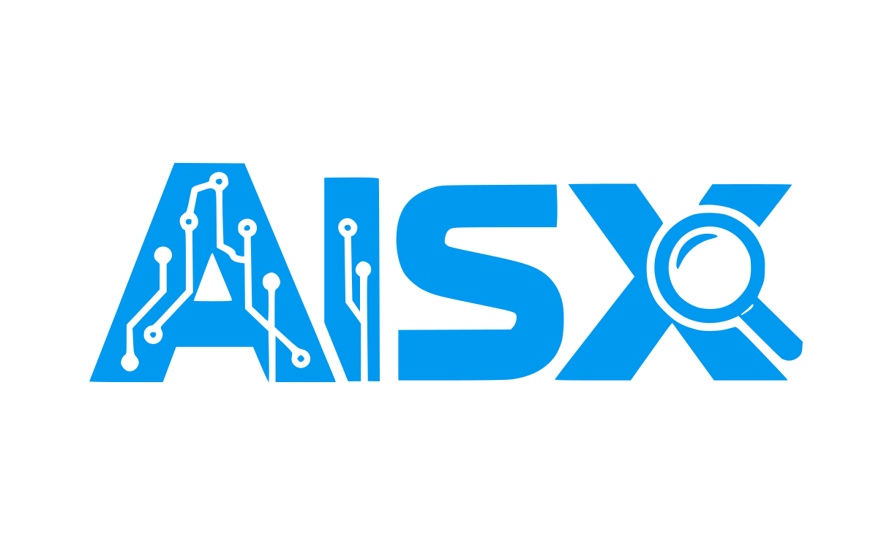

# vscode-AIsx

<p align="center">
  
</p>

<p align="center">
  <strong>AIsx</strong> stands for <strong>AI Session Xplorer</strong>.
</p>

<p align="center">
  
  > View, search, and reopen your local <strong>Codex</strong> and <strong>Claude Code</strong> session history directly inside <a href="https://github.com/VSCodium/vscodium">VSCodium</a>.
</p>

## What It Does

AIsx adds an Activity Bar view that indexes local AI session history and lets you inspect it without leaving your editor.

It currently supports:

- Claude Code session history
- Codex session history
- Search across sessions by prompt text, project path, or session id
- Source filters for Claude / Codex
- Full session viewer with rendered markdown
- Tool call and tool result inspection
- Claude file-history snapshot loading for tracked files

<details>
 <summary>Watch a video demo</summary>
 
 [aisx demo](https://github.com/user-attachments/assets/7ef4e7bf-cc3e-4d11-84f0-7e56dd777bf7)

</details>

## How It Works

AIsx reads session files from the tools you already use on your machine:

- Claude Code:
  - macOS / Linux: `~/.claude/projects`
  - Windows: `%APPDATA%/claude/projects`
- Claude file snapshots:
  - macOS / Linux: `~/.claude/file-history`
  - Windows: `%APPDATA%/claude/file-history`
- Codex:
  - `~/.codex/sessions`

The extension does not need a separate service or hosted backend. It reads local `.jsonl` session history files and renders them in VS Code.

## Features

### Session Sidebar

The `AI Session Xplorer` Activity Bar view shows a searchable list of sessions with:

- session source badge
- relative recency
- message count
- first prompt preview
- detected project / working directory

### Session Viewer

Opening a session creates a dedicated panel where you can:

- read the full conversation
- render markdown responses
- inspect tool invocations
- inspect tool results and errors
- filter the view to user, assistant, tool calls, tool results, or snapshots

### Claude File Snapshots

For Claude Code sessions, AIsx can load tracked file-history snapshots on demand from Claude's local backup store. Large files are truncated safely before display.

## Usage

1. Install the extension.
2. Open the `AIsx` icon in the VS Code Activity Bar.
3. Search or filter sessions by source.
4. Click any session to open it in a panel.
5. Use the panel filters to focus on messages, tool activity, or file snapshots.

Available commands:

- `AIsx: Refresh Sessions`
- `AIsx: Open Session`

## Install

### From a VSIX

```bash
pnpm install
pnpm package
```

Then install the generated `.vsix` in VS Code with:

```bash
code --install-extension aisx-*.vsix
```

### From Open VSX

If you publish it, install from Open VSX or through any VS Code-compatible distribution that supports Open VSX packages.

## Development

```bash
pnpm install
```

Then open the repo in VS Code and run the extension in an Extension Development Host from the standard Run and Debug flow.

Useful scripts:

- `pnpm lint`
- `pnpm test`
- `pnpm package`
- `pnpm esbuild:watch`

## Release

This repo is set up to publish to `Open VSX` and create a GitHub release on version tags.

Required GitHub Actions secret:

- `OPEN_VSX_TOKEN`

Manual publish commands:

```bash
pnpm run publish:open-vsx -p "$OPEN_VSX_TOKEN"
pnpm release
```

## Why AIsx

Session history is useful, but the default experience is usually buried in local JSONL files. AIsx makes that history searchable and readable where developers already work: inside the editor.

## An open letter to ~~Microsoft~~ Microslop!

```md
Let me be extremely clear: the Visual Studio Code Marketplace publishing
pipeline is a masterclass in hostile developer experience, needless bureaucracy,
and the kind of dark UX garbage Microsoft has been perfecting for decades.

I am trying to publish a simple VS Code extension. That should involve one
command and an API key. Instead, what you’ve built is an absurd maze of
unrelated Microsoft infrastructure duct-taped together with fragile tooling
and undocumented failure modes.

Let’s walk through the clown show.

First: publishing an extension requires a Personal Access Token from Azure
DevOps. Why the fuck is the VS Code Marketplace even coupled to Azure DevOps
in the first place? I’m not using Azure DevOps. I don’t want Azure DevOps.
I don’t need Azure DevOps. Yet somehow to publish an extension I’m forced
into your sprawling enterprise identity spaghetti just to generate a token
with "Marketplace (Manage)" scope.

Source: https://learn.microsoft.com/en-us/visualstudio/extensibility/publish/overview

This alone is already ridiculous, but it gets better.

Before I can even publish, I have to:

1.  Create an Azure DevOps organization if I don’t already have one.
2.  Generate a Personal Access Token with specific scopes.
3.  Create a Publisher identity in a completely different Marketplace management UI.
4.  Run `vsce login <publisher>` which asks me to paste the token into a CLI prompt like it’s 2005.
5.  Only THEN can I attempt `vsce publish`.

None of this is necessary. None of it improves security.
None of it improves developer experience. It is pure Microsoft process bloat.

And the tooling? `vsce` itself is brittle as hell. One wrong image format
in a README, one SVG somewhere in the project, one badge from a provider you
arbitrarily don’t trust, and suddenly publishing fails because the CLI decides
it’s the image police.

Source: https://code.visualstudio.com/api/working-with-extensions/publishing-extension

So instead of focusing on writing extensions, developers are stuck debugging
your arbitrary content filters, Marketplace constraints, and token scope errors
that return completely useless messages like:

"403 Forbidden"

No explanation. No diagnostics. Just another dead end in the Microsoft
documentation labyrinth.

And the UX patterns around all this are peak Microsoft:

• Multiple portals with different authentication states
• Token scopes hidden behind "Show all scopes" links
• A publisher identity system that can’t be renamed once created
• Documentation that assumes developers will happily reverse-engineer the workflow

This is the same company that somehow managed to turn something as simple as
publishing a plugin into a multi-service corporate compliance ritual.

Meanwhile platforms like npm, PyPI, Cargo, or even the Chrome Web Store manage
to publish packages with a fraction of the friction. But Microsoft? No.
You get Azure DevOps tokens, publisher IDs, CLI login prompts, portal
dashboards, and random validation rules sprinkled on top like a
bureaucratic shit sundae.

The end result is exactly what you’d expect:

• Developers waste hours fighting your publishing pipeline
• Extensions ship slower
• New developers give up entirely
• The Marketplace ecosystem becomes harder to contribute to

And this pattern isn’t limited to the Marketplace.
It reflects the broader Microsoft philosophy of:

"Take a simple developer task and bury it under five layers of enterprise infrastructure."

You’ve done it with Azure.
You’ve done it with identity.
You’ve done it with GitHub integrations.
And you’ve absolutely done it with VS Code extension publishing.

The tragic part is that VS Code itself is a genuinely good product.
Fast. Extensible. Loved by developers.

But the moment someone tries to contribute to the ecosystem,
they run headfirst into the Microsoft Bureaucracy Engine™ and the
whole illusion falls apart.

Fix your shit.

Publishing an extension should look like this:

    vsce publish --token $TOKEN

That’s it. One token. One command. Done.

No Azure DevOps organizations.
No hidden scope menus.
No multi-portal identity management.
No fucking scavenger hunt across Microsoft services.

Until then, the Marketplace publishing process will remain
one of the most unnecessarily painful developer workflows in modern tooling
that I have ever had the displeasure of trying.

Sincerely,
A developer who just wanted to publish a
goddamn extension without enrolling in the Microsoft
enterprise ecosystem circus.
```
